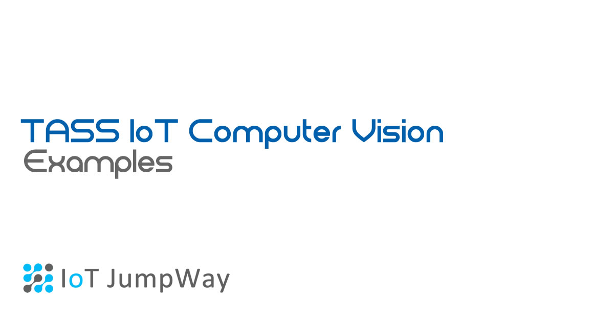
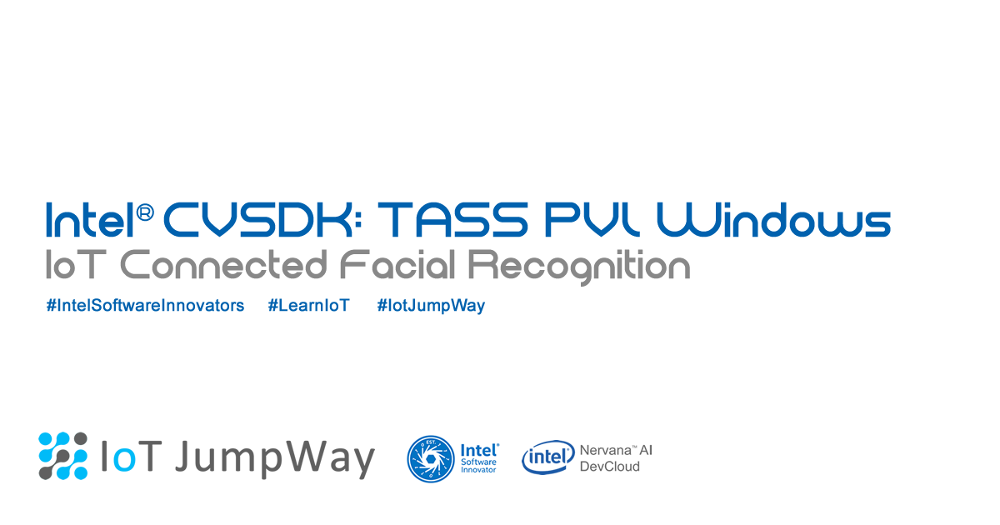
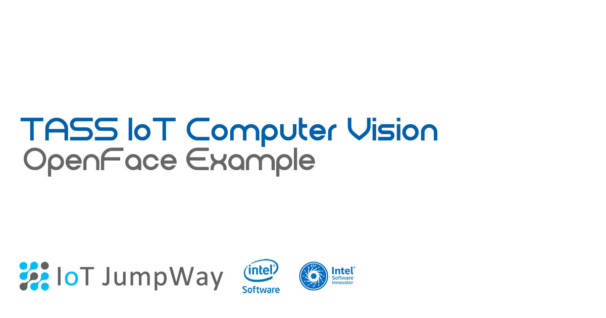

# TASS Computer Vision Demos

## TASS Movidius Computer Vision Demo

TASS Movidius uses pretrained **Inception V3 & Yolo models** and an **Intel® Movidius** to carry out object and **facial classification**, both locally and on a live webcam stream. TASS Movidius uses the [IoT JumpWay](https://iot.techbubbletechnologies.com "IoT JumpWay") for IoT communication and publishes messages to the broker when an object is identified.

---

## TASS PVL Computer Vision Demo

TASS PVL is a Computer Vision security system using Intel® Computer Vision SDK and an Intel® Edison connected to the Internet of Things via the IoT JumpWay.

---

## TASS OpenFace Computer Vision Demo

The tutorial will use  IoT JumpWay Python MQTT Library for communication, an Intel® NUC DE3815TYKE or any Linux Desktop running Ubuntu, 1 or more IP Cameras, an optional Realsense camera, and our own deep learning neural network based on the popular OpenFace facial recognition toolkit.

---

## Contributors

