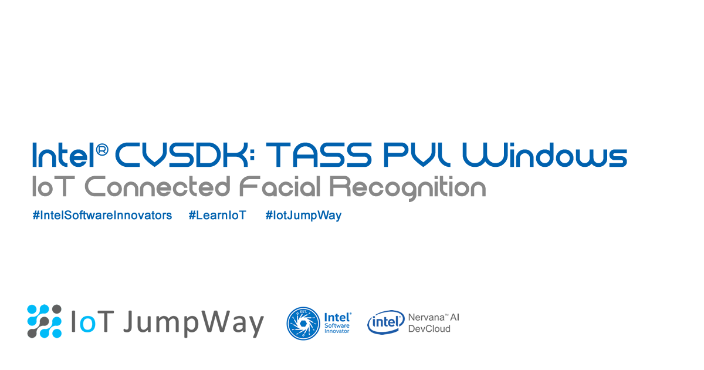

# IoT JumpWay Intel® Computer Vision SDK Examples

## Introduction

The Intel® Computer Vision SDK Windows examples provide example projects that you can use to get started with using the TechBubble IoT JumpWay for your Intel® Computer Vision SDK projects on Windows.

## Intel® Computer Vision SDK Windows Examples

- [TASS PVL RealSense Security System](https://github.com/SSG-DRD-IOT/demo-tass/tree/master/TASS-PVL/Windows/Realsense/ConsoleApp "TASS PVL RealSense Security System")

- [TASS PVL WebCam Security System](https://github.com/SSG-DRD-IOT/demo-tass/tree/master/TASS-PVL/Windows/Webcam/ConsoleApp "TASS PVL WebCam Security System")

## Intel® Computer Vision SDK Windows Docs

- [Installing Intel® Computer Vision SDK on Windows 10](https://github.com/SSG-DRD-IOT/demo-tass/tree/master/TASS-PVL/Windows/_Docs/1-Installing-Intel-CV-SDK.md "Installing Intel® Computer Vision SDK on Windows 10")

- [Installing Intel® RealSense SDK on Windows 10](https://github.com/SSG-DRD-IOT/demo-tass/tree/master/TASS-PVL/Windows/_Docs/2-Installing-Intel-RealSense-SDK.md "Installing Intel® RealSense SDK on Windows 10")

## Contributors

